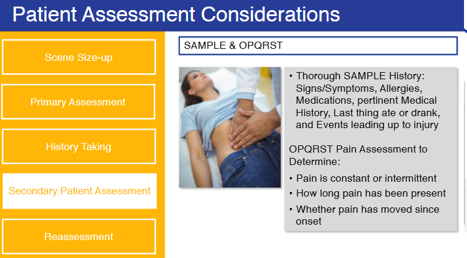
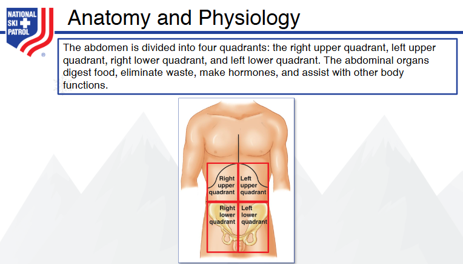
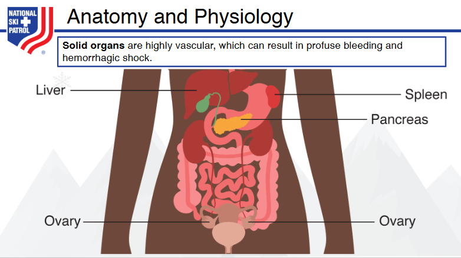
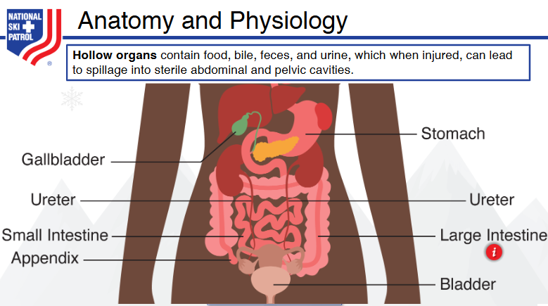
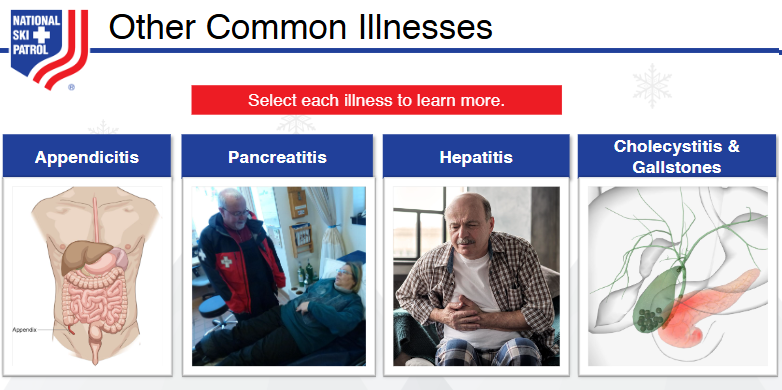
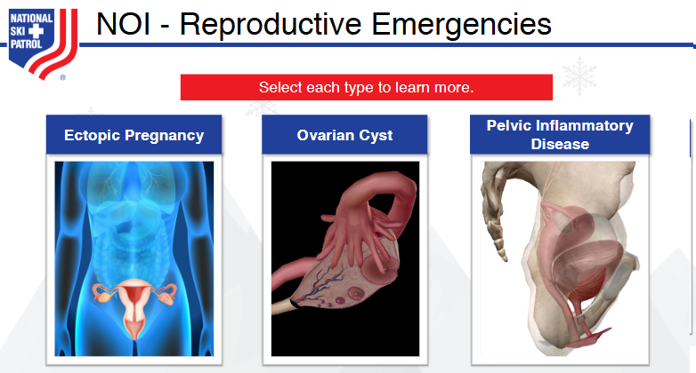

    
# Nsp Oec Training Chapter 16 

## National Ski Patrol - Outdoor Emergency Care chapter 16

    

    
## Table of Contents

- [Solution Overview](#solution-overview)
- [Who will use this ?](#who-can-use)
- [Advantages of Using](#advantages-of-using)
- [Return on Investment (ROI)](#return-on-investment-roi)
- [How it Works](#how-it-works)
- [Conclusion](#conclusion)
- [Getting Started](#getting-started)
- [Solution Features](#solution-features)
- [Code Features](#code-features)
- [Deliverables or Figures](#deliverables-or-figures)
- [Contact Information](#contact-information)

## Chapter 16: Gastrointestinal, Genitourinary, and Reproductive System Emergencies

1. List the possible causes of emergencies involving the gastrointestinal, genitourinary, and reproductive systems. 
2. List the signs and symptoms of emergencies involving the genitourinary system.
3. List the sign and symptoms of emergencies involving the gastrointestinal system.
4. List the signs and symptoms of emergencies related to the reproductive system.
5. Describe and demonstrate how to assess the abdomen.
6. Describe and demonstrate the management of a patient with a gastrointestinal, genitourinary, or reproductive emergency.

## 16.1 List the possible causes of emergencies involving the gastrointestinal, genitourinary, and reproductive systems. 

Emergencies involving the gastrointestinal (GI), genitourinary (GU), and reproductive systems can arise from various conditions, and understanding these causes is essential for effective assessment and response. Here’s a brief overview of possible causes:

### Gastrointestinal System Emergencies
1. **Obstruction**: Blockages in the intestines (e.g., bowel obstruction, volvulus) can cause severe pain and vomiting.
2. **Bleeding**: Upper GI bleeding (e.g., peptic ulcers, esophageal varices) and lower GI bleeding (e.g., diverticulosis, colorectal cancer) can lead to significant blood loss.
3. **Inflammatory Conditions**: Appendicitis, pancreatitis, and inflammatory bowel disease (IBD) like Crohn’s disease and ulcerative colitis.
4. **Perforation**: Ruptures in the stomach or intestines, often due to ulcers or trauma, leading to peritonitis.
5. **Infections**: Gastroenteritis, diverticulitis, or abscesses.

### Genitourinary System Emergencies
1. **Kidney Stones**: Obstruction of the urinary tract due to stones causing intense pain and sometimes infection.
2. **Acute Urinary Retention**: Inability to urinate, often due to an enlarged prostate or bladder obstruction.
3. **Infections**: Pyelonephritis (kidney infection), cystitis (bladder infection), and urinary tract infections (UTIs).
4. **Trauma**: Injuries to the kidneys, bladder, or urethra, which can result in bleeding and impaired function.
5. **Acute Renal Failure**: Sudden loss of kidney function, possibly due to dehydration, toxins, or severe infections.

### Reproductive System Emergencies
1. **Ectopic Pregnancy**: A fertilized egg implants outside the uterus, often in a fallopian tube, causing severe pain and risk of rupture.
2. **Ovarian Torsion**: Twisting of the ovary, leading to severe pain and potentially loss of ovarian function.
3. **Testicular Torsion**: Twisting of the spermatic cord, cutting off blood supply to the testicle, which can cause intense pain and require immediate intervention.
4. **Sexually Transmitted Infections (STIs)**: Severe complications from untreated infections, like pelvic inflammatory disease (PID) or epididymitis.
5. **Postpartum Hemorrhage**: Heavy bleeding after childbirth, which can be life-threatening if not managed promptly.

Each of these conditions can present with varying symptoms and severity, and rapid assessment is crucial for determining the appropriate treatment pathway.

## 16.2 List the signs and symptoms of emergencies involving the genitourinary system.

Emergencies involving the genitourinary system can present with various signs and symptoms, depending on the underlying cause. Here are some common signs and symptoms to watch for:

### General Symptoms
- **Severe, sudden pain**: Often in the lower abdomen, back, or groin. The pain may radiate to other areas and can vary in intensity.
- **Hematuria**: Presence of blood in the urine, which may be visible (red or brown) or detected microscopically.
- **Fever and chills**: May indicate an infection such as pyelonephritis or sepsis.
- **Nausea and vomiting**: Often accompanying severe pain, particularly in cases like kidney stones.

### Specific Symptoms
1. **Kidney Stones**
   - Intense, cramping pain in the side, lower back, or abdomen (renal colic).
   - Pain that may radiate to the groin or genitals.
   - Nausea, vomiting, and persistent need to urinate.
   - Blood in urine (hematuria).

2. **Acute Urinary Retention**
   - Inability to urinate despite feeling a strong urge.
   - Lower abdominal pain and distention.
   - Sensation of fullness in the bladder region.

3. **Urinary Tract Infections (UTIs)**
   - Burning sensation during urination (dysuria).
   - Frequent urge to urinate, even when little urine is produced.
   - Cloudy, foul-smelling, or dark urine.
   - Lower abdominal or pelvic discomfort.

4. **Pyelonephritis (Kidney Infection)**
   - High fever, chills, and severe flank pain.
   - Nausea, vomiting, and general malaise.
   - Painful urination, urgency, and frequent urination.
   - Blood or pus in urine (hematuria or pyuria).

5. **Acute Renal Failure**
   - Reduced or no urine output (oliguria or anuria).
   - Swelling in legs, ankles, and around the eyes (edema).
   - Shortness of breath, confusion, and lethargy.
   - Irregular heartbeat or chest pain in severe cases.

6. **Testicular Torsion**
   - Sudden, severe testicular pain and swelling, often on one side.
   - Abdominal pain, nausea, and vomiting.
   - Affected testicle may be higher or lie at an unusual angle.
   - Pain may not be relieved by rest or repositioning.

7. **Bladder or Urethral Trauma**
   - Pain and tenderness in the pelvic area.
   - Visible blood in urine.
   - Difficulty or inability to urinate.
   - Swelling and bruising around the genital or pelvic region.

These signs and symptoms can indicate serious conditions that require immediate medical attention. Proper and timely assessment is crucial to prevent complications and ensure appropriate care.

## 16.3 List the sign and symptoms of emergencies involving the gastrointestinal system.

Emergencies involving the gastrointestinal (GI) system can present with a variety of signs and symptoms, often reflecting the severity and location of the underlying condition. Here are common symptoms to be aware of:

### General Symptoms
- **Severe abdominal pain**: Can be localized or diffuse, often sudden and intense.
- **Nausea and vomiting**: Persistent, sometimes with blood (hematemesis) if there is bleeding in the upper GI tract.
- **Diarrhea**: Can be watery, bloody, or contain mucus, often accompanied by cramping.
- **Constipation**: Inability to pass stool or gas, sometimes with abdominal swelling.
- **Fever**: May indicate an infection or inflammation, such as in appendicitis or diverticulitis.
- **Signs of shock**: Pale skin, rapid heartbeat, low blood pressure, dizziness, or fainting, especially if there is significant internal bleeding.

### Specific Symptoms
1. **Gastrointestinal Bleeding**
   - **Upper GI bleeding**: Vomiting blood (hematemesis) that may look bright red or like coffee grounds; black, tarry stools (melena).
   - **Lower GI bleeding**: Bright red blood in stools or dark, maroon stools.
   - Weakness, dizziness, and potential signs of shock if there is significant blood loss.

2. **Bowel Obstruction**
   - Crampy, colicky abdominal pain, often severe.
   - Nausea and vomiting, sometimes with vomit containing fecal material (in advanced cases).
   - Distended abdomen and inability to pass gas or stool.
   - High-pitched bowel sounds or, in advanced cases, absence of bowel sounds.

3. **Appendicitis**
   - Pain that starts near the belly button and shifts to the lower right abdomen.
   - Pain worsens with movement, coughing, or pressing on the area.
   - Fever, nausea, vomiting, and loss of appetite.

4. **Peritonitis**
   - Severe, widespread abdominal pain that can be sharp or continuous.
   - Tenderness, often with a rigid or board-like abdomen.
   - Fever, chills, and signs of severe illness, like rapid heartbeat and low blood pressure.
   - Nausea, vomiting, and loss of appetite.

5. **Pancreatitis**
   - Severe upper abdominal pain that may radiate to the back.
   - Pain that worsens after eating, especially fatty foods.
   - Nausea, vomiting, and fever.
   - Abdominal tenderness and, in severe cases, signs of shock.

6. **Cholecystitis (Gallbladder Inflammation)**
   - Sharp pain in the upper right abdomen or center that may radiate to the right shoulder or back.
   - Pain after eating, particularly fatty meals.
   - Nausea, vomiting, and fever.
   - Tenderness over the gallbladder (Murphy's sign).

7. **Diverticulitis**
   - Pain, usually on the lower left side of the abdomen.
   - Fever, chills, and nausea.
   - Changes in bowel habits, such as constipation or diarrhea.
   - Bloating and tenderness in the affected area.

8. **Peptic Ulcer Perforation**
   - Sudden, severe, sharp abdominal pain, often in the upper abdomen.
   - Rigid, tender abdomen due to peritoneal irritation.
   - Nausea, vomiting, and signs of shock if there is severe bleeding or perforation.

These signs and symptoms often require immediate medical attention, as they can indicate potentially life-threatening conditions. Rapid assessment and intervention are critical to prevent complications and provide appropriate care.

## 16.4 List the signs and symptoms of emergencies related to the reproductive system.

Emergencies involving the reproductive system can present with a range of symptoms, often requiring prompt medical attention. Here are common signs and symptoms associated with reproductive system emergencies:

### General Symptoms
- **Severe pelvic or abdominal pain**: Sudden or persistent, often localized to one side or spreading across the lower abdomen.
- **Abnormal bleeding**: Unusual vaginal bleeding, including heavy periods, spotting between periods, or post-menopausal bleeding.
- **Fever and chills**: May indicate an infection such as pelvic inflammatory disease (PID) or an abscess.
- **Nausea and vomiting**: Often accompanying severe pain or as a result of internal complications.
- **Signs of shock**: Pale skin, rapid heartbeat, low blood pressure, dizziness, or fainting, especially if there is internal bleeding.

### Specific Symptoms
1. **Ectopic Pregnancy**
   - Sharp, stabbing pain on one side of the lower abdomen or pelvis.
   - Vaginal bleeding or spotting, often lighter than a regular period.
   - Dizziness, fainting, and signs of shock in cases of rupture.
   - Shoulder pain (referred pain due to internal bleeding irritating the diaphragm).

2. **Ovarian Torsion**
   - Sudden, severe, cramping or sharp pain on one side of the lower abdomen.
   - Nausea and vomiting, often accompanying the pain.
   - Abdominal tenderness and possible low-grade fever.
   - Symptoms may come and go as the ovary twists and untwists.

3. **Testicular Torsion**
   - Sudden, intense pain in one testicle, often with swelling.
   - Lower abdominal pain, nausea, and vomiting.
   - The affected testicle may be positioned higher or at an unusual angle.
   - Scrotal swelling, redness, and tenderness.

4. **Pelvic Inflammatory Disease (PID)**
   - Lower abdominal or pelvic pain, often dull or cramping.
   - Abnormal vaginal discharge, which may have an unpleasant odor.
   - Pain during intercourse (dyspareunia) or urination.
   - Fever, chills, and general feeling of illness.
   - Irregular menstrual bleeding or spotting.

5. **Ovarian Cyst Rupture**
   - Sudden, sharp pelvic pain, typically on one side.
   - Pain may worsen with activity or physical exertion.
   - Abdominal bloating, tenderness, and discomfort.
   - Light vaginal bleeding and possible nausea and vomiting.

6. **Postpartum Hemorrhage**
   - Heavy vaginal bleeding after childbirth, possibly soaking through pads quickly.
   - Signs of shock: dizziness, rapid heart rate, weakness, and fainting.
   - Lower abdominal pain and cramping.
   - Pale, clammy skin and confusion in severe cases.

7. **Prostatitis (Acute)**
   - Pain or discomfort in the lower abdomen, groin, or back.
   - Painful urination (dysuria) and frequent, urgent need to urinate.
   - Painful ejaculation and discomfort in the testicles or perineum.
   - Fever, chills, and flu-like symptoms.

8. **Miscarriage (Spontaneous Abortion)**
   - Vaginal bleeding or spotting, often accompanied by cramping.
   - Lower abdominal pain that may range from mild to severe.
   - Passing of tissue or clots from the vagina.
   - Back pain and general feeling of discomfort.

These symptoms can indicate serious conditions that may require immediate medical evaluation and intervention. Proper assessment and rapid response are crucial to managing these emergencies effectively and minimizing the risk of complications.

## 16.5 Describe and demonstrate how to assess the abdomen.

Assessing the abdomen is a crucial part of a physical examination, especially when there is a suspicion of abdominal pain or other gastrointestinal, genitourinary, or reproductive system issues. The assessment process typically involves **inspection, auscultation, percussion, and palpation**. Here’s how each step is performed:

### 1. **Inspection**
   - **Purpose**: To visually assess the abdomen for any abnormalities.
   - **Procedure**:
     - Position the patient comfortably, lying on their back with arms at their sides.
     - Expose the abdomen, ensuring privacy and warmth, and inspect it for **symmetry, skin color, scars, rashes, bruising, or visible masses**.
     - Observe the **contour** (flat, rounded, concave) and check for any **visible movements** such as peristalsis or pulsations (e.g., aortic pulsation in the upper abdomen may indicate an aneurysm).

### 2. **Auscultation**
   - **Purpose**: To listen for bowel sounds and any vascular sounds, before palpation or percussion, as these can alter bowel activity.
   - **Procedure**:
     - Use the **diaphragm** of the stethoscope and place it gently on the abdomen.
     - Start in the **right lower quadrant** and move in a clockwise direction through all four quadrants.
     - Listen for **bowel sounds**: They are normally intermittent, soft gurgling noises that occur every 5-15 seconds. 
     - Absence of bowel sounds may indicate **ileus** (a lack of intestinal activity), while **hyperactive sounds** could suggest **diarrhea** or **bowel obstruction**.
     - Use the **bell** of the stethoscope to listen for any **bruits** (whooshing sounds) over major arteries (aorta, renal, iliac, and femoral), which may indicate **vascular abnormalities**.

### 3. **Percussion**
   - **Purpose**: To assess for **fluid, gas, or masses** and to determine the size of organs like the liver and spleen.
   - **Procedure**:
     - Percuss each quadrant by placing your non-dominant hand on the abdomen and tapping it with your dominant hand’s fingers.
     - Listen for the sound:
       - **Tympany** (a hollow, drum-like sound) is normal over the intestines.
       - **Dullness** indicates the presence of a **solid organ** (like the liver), a **mass**, or **fluid** (like ascites).
     - Percuss the **liver span** by starting from the right midclavicular line, below the nipple, and moving down to find the upper and lower borders of the liver.
     - Percuss the **spleen** by starting in the left upper quadrant. A dull note indicates possible **splenomegaly** (enlarged spleen).

### 4. **Palpation**
   - **Purpose**: To feel for **tenderness, masses, organ size**, and other abnormalities.
   - **Procedure**:
     - Start with **light palpation**: Use the flat part of your fingers to gently press down, feeling for tenderness or any superficial masses.
     - Continue with **deep palpation**: Use more pressure to feel deeper structures, moving through all four quadrants. 
     - Palpate the **liver** by placing your hand just below the right costal margin and pressing gently while the patient takes a deep breath. The edge of the liver may be felt descending.
     - Check for **rebound tenderness** (e.g., in suspected peritonitis): Gently press down on the abdomen and quickly release. Pain upon release may indicate peritoneal irritation.
     - **Palpate the spleen** in the left upper quadrant, pressing gently while the patient takes a deep breath.

### Signs to Note During Palpation:
   - **Guarding**: Involuntary tensing of the abdominal muscles in response to palpation, often indicating peritonitis.
   - **Rigidity**: A firm, board-like abdomen that does not relax, also suggesting peritoneal inflammation.
   - **Masses**: Note the size, shape, mobility, and consistency (e.g., soft, firm, hard).
   - **Tenderness**: Observe for any pain, noting the specific area.

### **Demonstration Approach**
When assessing the abdomen, remember to:
1. Ensure **patient comfort and privacy**.
2. Use a **gentle, systematic approach**, moving through each quadrant.
3. Observe the **patient’s facial expressions** for signs of pain or discomfort, especially during palpation.

Proper technique and methodical assessment can provide valuable information about the underlying condition, guiding further diagnostics or interventions.

## 16.6 Describe and demonstrate the management of a patient with a gastrointestinal, genitourinary, or reproductive emergency.

Management of emergencies involving the gastrointestinal (GI), genitourinary (GU), or reproductive systems requires a prompt and systematic approach. Here’s how to manage such cases, including key steps and interventions:

### General Management Principles
1. **Initial Assessment**:
   - Follow the **ABCs** (Airway, Breathing, Circulation) to ensure the patient’s vital functions are stable.
   - Obtain **vital signs** (heart rate, blood pressure, respiratory rate, oxygen saturation, and temperature).
   - Assess the patient's **level of consciousness** and general appearance (e.g., pallor, sweating, agitation).
   - Begin with a **focused history** using the **OPQRST** mnemonic:
     - **O**: Onset of symptoms (when did it start? sudden or gradual?)
     - **P**: Provocation/Palliation (what makes it worse or better?)
     - **Q**: Quality (describe the pain; is it sharp, dull, cramping?)
     - **R**: Radiation (does the pain move to another part of the body?)
     - **S**: Severity (on a scale of 1-10, how bad is the pain?)
     - **T**: Time (how long has the pain been present? Any changes?)

2. **Focused Physical Examination**:
   - **Inspect** the patient for signs like abdominal distension, visible masses, or abnormal skin color.
   - Perform **auscultation**, **percussion**, and **palpation** to identify specific areas of tenderness or abnormal sounds.
   - Check for signs of **shock** (e.g., low blood pressure, rapid pulse, cool and clammy skin) and evaluate for **bleeding**, whether visible or internal.

3. **Establish Intravenous (IV) Access**:
   - Start with **IV fluids** to ensure the patient is well-hydrated, especially if there is a concern for shock, dehydration, or blood loss.
   - Consider **analgesia** for pain management and **antiemetics** if the patient has nausea or vomiting.

4. **Monitoring and Support**:
   - Continuous **monitoring of vital signs**.
   - Provide **oxygen** if the patient is in distress or showing signs of low oxygen saturation.
   - Be prepared for **airway management** if the patient is unstable or at risk of aspiration.

### Specific Management Based on Emergency Type

#### 1. **Gastrointestinal Emergencies**
   - **Example**: Acute Appendicitis, Bowel Obstruction, GI Bleeding
     - **Supportive Care**: Keep the patient **NPO** (nothing by mouth) if surgery is a possibility. 
     - **IV Fluids**: Administer **crystalloids** (like normal saline) to maintain hydration.
     - **Pain Management**: Administer analgesics (e.g., morphine or fentanyl).
     - **Specific Interventions**: For suspected GI bleeding, consider placing a **nasogastric (NG) tube** to assess bleeding and monitor output. In severe cases, **blood transfusions** may be needed.
     - **Surgical Consult**: Immediate evaluation by a surgeon if there is a concern for conditions like **appendicitis, perforated ulcer, or bowel obstruction**.

#### 2. **Genitourinary Emergencies**
   - **Example**: Kidney Stones, Acute Urinary Retention, Testicular Torsion
     - **Supportive Care**: Position the patient comfortably and administer **pain relief**.
     - **Pain Management**: Use **NSAIDs** or opioids to manage severe pain, especially in cases of kidney stones.
     - **Urinary Catheterization**: If there is **acute urinary retention**, insert a catheter to relieve the blockage.
     - **Specialized Interventions**: For **testicular torsion**, immediate manual detorsion may be attempted, but **surgical intervention** is usually required within **4-6 hours** to save the testicle.

#### 3. **Reproductive Emergencies**
   - **Example**: Ectopic Pregnancy, Ovarian Torsion, Postpartum Hemorrhage
     - **Supportive Care**: Place the patient in a comfortable position, and ensure **continuous monitoring**.
     - **IV Fluids and Blood Products**: In cases of **hemorrhage**, start **IV fluids** rapidly, and consider blood transfusions if necessary. 
     - **Pain and Antiemetic Management**: Use appropriate medications to control **pain** and **nausea**.
     - **Ultrasound**: Often required for diagnosis, especially in conditions like **ectopic pregnancy or ovarian torsion**.
     - **Surgical or Obstetric Consult**: Immediate involvement of **gynecology** or **obstetric** teams is necessary for conditions such as **ectopic pregnancy, ovarian torsion, or severe postpartum hemorrhage**.

### **Demonstration of Management Approach**
1. **Safety and Preparation**:
   - **Gloves and personal protective equipment (PPE)** should be used to prevent infection and ensure safety.
   - **Gather equipment**: IV supplies, medication, monitoring devices, and resuscitation tools.

2. **Initial Rapid Assessment**:
   - Ensure **ABC stability** (e.g., open airway, adequate breathing, and circulation).
   - Quickly **assess vital signs** and get a brief **history** from the patient or bystanders.

3. **Stepwise Intervention**:
   - If the patient has **severe abdominal pain** with signs of shock (pale, sweaty, low BP), immediately begin **IV fluids** and **oxygen**.
   - Monitor the patient continuously and **prepare for emergency interventions** (e.g., surgery or catheterization).
   - Contact **specialists** early, such as a **surgeon, urologist, or gynecologist**, to ensure prompt definitive care.

### Summary:
Managing emergencies involving the GI, GU, and reproductive systems requires a **calm, systematic approach** to stabilize the patient and address the underlying issue. Prompt assessment, early intervention, and multidisciplinary coordination are crucial to patient outcomes.

    

    
## Getting Started

The goal of this solution is to **Jump Start** your development and have you up and running in 30 minutes. 

To get started with the **Nsp Oec Training Chapter 16** solution repository, follow these steps:
1. Clone the repository to your local machine.
2. Install the required dependencies listed at the top of the notebook.
3. Explore the example code provided in the repository and experiment.
4. Run the notebook and make it your own - **EASY !**
    
## Solution Features

- Easy to understand and use  
- Easily Configurable 
- Quickly start your project with pre-built templates
- Its Fast and Automated
- Saves You Time 

## Code Features

These features are designed to provide everything you need for **Nsp Oec Training Chapter 16** 

- **Self Documenting** - Automatically identifes major steps in notebook 
- **Self Testing** - Unit Testing for each function
- **Easily Configurable** - Easily modify with **config.INI** - keyname value pairs
- **Includes Talking Code** - The code explains itself 
- **Self Logging** - Enhanced python standard logging   
- **Self Debugging** - Enhanced python standard debugging
- **Low Code** - or - No Code  - Most solutions are under 50 lines of code
- **Educational** - Includes educational dialogue and background material

    
## List of Figures
                            
    

## Github https://github.com/JoeEberle/ - Email  josepheberle@outlook.com 
    

    